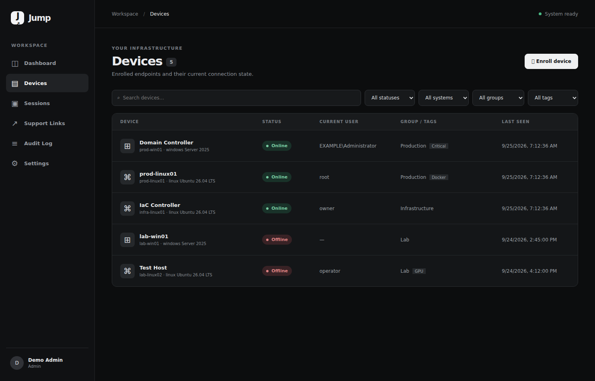

# Jump

Jump is a self-hosted remote access foundation for a single environment. This first release provides OIDC sign-in, device enrollment, persistent outbound agent presence, device organization, and audit events. **Remote RDP, SSH, files, and actions are not implemented yet.**

## Components

- **jump** — FastAPI, React, OIDC, PostgreSQL models and migrations.
- **broker** — Go WebSocket service for enrolled agents and presence.
- **agent** — Go executable for Windows amd64 and Linux amd64.
- **guacd** — official Apache Guacamole protocol daemon, reserved for Phase 2. The Guacamole web app is not included.
- **postgres** — PostgreSQL 18 in a named volume.

See [architecture](docs/architecture.md), [deployment](docs/deployment.md), and [security](SECURITY.md).

## Interface preview

Screenshots use illustrative device data:



[Device details](docs/screenshots/device-details.png) · [Dashboard](docs/screenshots/dashboard.png)

## Quick start

1. Download [`docker-compose.yml`](docker-compose.yml) and [`.env.example`](.env.example) into a directory on the Jump host; no source checkout is needed. Copy `.env.example` to `.env`. Generate independent secrets: `openssl rand -hex 32` for the database password, session secret and broker internal token, and `openssl rand -base64 32` for `JUMP_MASTER_KEY`. Back up the master key separately.
2. Configure an OIDC client with the redirect URI `https://jump.example.com/auth/callback`. Set issuer, client ID and secret in `.env`. Set your real HTTPS URLs and allowed hostname.
3. Set `JUMP_BIND_ADDRESS` to the Jump host's private LAN IP when Nginx Proxy Manager runs on another host. Allow only that NPM host to reach TCP 8000 and 8080 on the Jump host. Configure HTTPS, WebSocket support on the agent host, and the [proxy settings](docs/deployment.md).
4. Run `docker compose pull && docker compose up -d`. The application applies Alembic migrations before starting. The production Compose file uses `ghcr.io/hotjared/jump` and `ghcr.io/hotjared/jump-broker`; it does not build locally. The repository owner must make both GHCR packages public after their first publication, or the server must authenticate with a read-only package token.
5. Sign in. **The first successfully authenticated OIDC user becomes admin.** Subsequent users are created with the `user` role. Configure the identity provider to admit only intended users before exposing Jump.
6. In **Devices → Enroll device**, choose an OS, download the native agent, generate a token, and run the displayed enrollment and native service-install commands on the endpoint. The token expires after 15 minutes and is shown once. The installed service keeps the device online after the terminal closes and across reboots.

The agent defaults to `/var/lib/jump-agent/identity.json` on Linux and `%ProgramData%\\Jump\\identity.json` on Windows. After enrollment, run `service install` from an elevated shell. Linux installs `/usr/local/bin/jump-agent` plus `jump-agent.service`; Windows installs the `JumpAgent` service running as LocalSystem. `service uninstall` removes the service configuration but intentionally preserves the enrolled identity. The foreground `run` command remains available for diagnostics and development. Use `JUMP_AGENT_STATE` to set another path for foreground/development use. The broker only accepts inbound requests through the reverse proxy; endpoints initiate all connections.

For upgrades, rollback, GHCR visibility, and local image builds for development, see [deployment and operations](docs/deployment.md).

## Native agent downloads

Jump offers Linux amd64 and Windows amd64 binaries from the matching [GitHub Release](https://github.com/hotjared/jump/releases). The enrollment UI links to the selected binary and `SHA256SUMS`; no Go toolchain or source checkout is needed on endpoints. A tagged server image offers its matching agent release. When deploying `latest` or a commit SHA, set `JUMP_AGENT_VERSION` to an existing `v*` release tag in `.env` and restart Jump. The UI does not offer a download until a release version is known and its assets have been published.

Download `SHA256SUMS` alongside the binary. On Linux, verify the selected entry with:

```sh
grep ' jump-agent-linux-amd64$' SHA256SUMS | sha256sum -c -
chmod +x jump-agent-linux-amd64
```

On Windows, run `Get-FileHash .\jump-agent-windows-amd64.exe -Algorithm SHA256` in PowerShell and compare its hash with the Windows line in `SHA256SUMS`. Windows binaries are currently unsigned and may trigger Microsoft SmartScreen. Check the release source and hash before deciding whether to run one; Jump does not bypass Windows warnings.

### Agent lifecycle

Normal endpoint setup is:

```text
download
enroll
service install
automatic startup
revoke if compromised/decommissioned
optional delete from Jump
```

Linux uses native systemd with automatic startup and restart-on-failure. Windows uses the native Service Control Manager with the stable service name `JumpAgent`, display name `Jump Agent`, automatic startup, LocalSystem, and restart-on-failure recovery actions. No third-party service wrapper is required.

Revocation permanently invalidates the enrolled agent identity and disconnects any active broker connection. A revoked, offline device can then be permanently deleted from Jump. Deletion is irreversible, does not revoke implicitly, and does not make the deleted agent key usable again; the broker treats the removed identity as unknown.

## Build agent from source (developers)

```sh
cd agent
go build -o jump-agent .
GOOS=windows GOARCH=amd64 go build -o jump-agent.exe .
```

Source builds report `dev`; release builds report the tag in the device metadata.

## Status

This is an early security-sensitive foundation. Review [known limitations](docs/architecture.md#known-limitations) before exposing it to the Internet.
