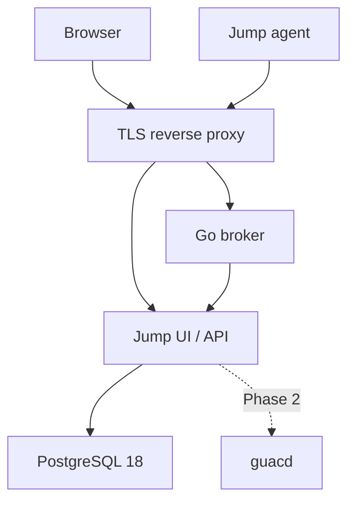

# Architecture

## Trust flow

The browser authenticates with a standards-based OIDC provider using authorization code flow and state/nonce validation through Authlib. Jump maps the pair `(issuer, subject)` to a local user. The first authenticated user becomes admin under a serialized database lock; later users get the user role. Privileged mutations check the admin role on the API. An HTTP-only, SameSite=Lax, Secure cookie holds a signed session identifier; mutating browser requests require an exact configured Origin and session-bound CSRF token. The identity provider owns MFA policy.

An admin creates a 256-bit random enrollment token. PostgreSQL stores only its SHA-256 digest, expiry, creator and redemption state. The browser displays plaintext once. The agent generates an Ed25519 keypair **before** enrollment, sends only its public key and token over HTTPS, and stores the private key locally. An atomic conditional database update consumes the token, creates a stable device UUID, and records the public key in one transaction.

For each new WebSocket connection, the broker fetches the active public key from the private API, sends a fresh 32-byte random challenge, and verifies a signature over `jump-agent-v1:` plus the challenge. It never reuses a nonce. A successful connection gets a unique connection ID. The API accepts heartbeat and disconnect only for the current ID, so an old connection cannot mark a replacement offline. Revoking an agent identity under the admin session records the actor and device, permanently rejects its public key, clears presence, and calls a separate authenticated private broker listener to close the active WebSocket. The connection registration and broker disconnect are serialized, while the API locks the device and identity rows so an in-flight handshake cannot revive a revoked device. Revocation retains the device record and audit history; deletion is a separate operation. A failed broker callback returns 503 after the revocation is committed, so an admin can retry the idempotent action; subsequent heartbeats and reconnects are still denied. The broker reconciles online flags on startup. It pings every 25 seconds and closes idle connections after 75 seconds; the agent heartbeats every 20 seconds and reconnects with capped exponential backoff and jitter.

The V1 JSON envelope has a mandatory `version` and `type`. Messages are capped at 16 KiB. Only `challenge`, `auth`, `ready`, and `heartbeat` exist. Future protocol versions can add typed stream open/data/close frames with stream IDs, flow control and per-operation authorization. Never treat the present connection as permission to perform endpoint actions.

## Data and credential boundary

Users, devices, group membership, many-to-many tags, enrollment tokens, Ed25519 public identities, credentials, and general audit events live in PostgreSQL. Devices use a UUID independent of hostname. Credential secrets are encrypted in the API with AES-256-GCM, a 96-bit random nonce, version number, and credential-ID authenticated associated data. `JUMP_MASTER_KEY` is external and never goes into PostgreSQL. The UI and device APIs have no endpoint for decrypted secrets. SSH session startup decrypts only the selected credential and sends it to the agent for that session. Future rotation will decrypt each record under its stored version and re-encrypt with the new key. Keep retired keys until rotation completes.

## Future session gateway

- RDP: browser → Jump session gateway → guacd → broker temporary reverse stream → persistent agent → `127.0.0.1:3389` on Windows.
- SSH: browser → Jump session gateway → broker logical session over the persistent agent connection → agent SSH client → `127.0.0.1:22` on Linux.
- Files: browser → Jump API → broker → agent → local filesystem. Planned operations: list, upload, download, rename, delete, create directory. This is separate from Guacamole drive redirection and SFTP.

The agent initiates outbound TLS connections. Endpoints need no inbound Internet ports.

## Roadmap

- **Phase 2:** browser SSH is implemented over multiplexed logical agent sessions. RDP, file transfer, and remote actions remain future work.
- **Phase 3:** cross-platform files, shell/PowerShell, reboot and restart-agent actions, richer system information.
- **Screen Control v1:** Windows console capture/control uses an interactive helper launched by the enrolled LocalSystem service. Attended Quick Support and consent workflows remain future work.

No VNC, session recording, multitenancy, monitoring, patching, alerting or billing is planned for this foundation.

## Known limitations

- No RDP or file operations yet; those capability names are descriptive.
- `current_user` reports the agent process account where available, not a detected interactive desktop session.
- No credential management API or UI yet. The encrypted model and service functions are in place.
- No internal device certificate authority yet. Ed25519 challenge/response can later be replaced by short-lived device certificates, keeping the same public identity and enrollment boundary.
- Presence is held by one broker process. Scaling to multiple replicas needs shared coordination and routing; run one broker for now.
- OIDC provider and its access policy must be configured by the operator. There is no local login or recovery login.
## SSH session path

Browser → authenticated Jump WebSocket → private token-authenticated broker
session channel → existing Ed25519-authenticated agent WebSocket → agent SSH
client → `127.0.0.1:22`.

The broker multiplexes session IDs over the one agent connection while
presence and heartbeats continue. Each browser session is owned by a Jump user
and has a database row for creation, activity, connection, and close state.
Jump sends only the selected decrypted credential in a single `session_open`
message to that agent. The agent reports the host-key fingerprint after SSH
authentication; Jump pins it on first success and rejects a later mismatch.
Terminal bytes are forwarded with bounded frames and are never persisted.

## Screen Control session path

Browser → authenticated Jump WebSocket → private bearer-authenticated broker screen route → existing Ed25519-authenticated outbound agent connection → private local named pipe → interactive desktop helper.

Screen Control uses `RemoteSession.protocol = "screen"`, the existing workspace, session Diagnostics and Audit Log. Session creation requires an administrator, an online Windows device, a non-revoked identity and `screen_control_v1`. The session snapshots the device connection ID and reserves one controller per device with a partial unique database index. Browser attachment is one-shot; the broker rechecks ownership and the exact connection through the backend before routing.

The service discovers the physical console session using WTS APIs and confirms a logged-in user exists. It duplicates its LocalSystem primary token, sets its session ID, and launches the protected installed `jump-agent.exe internal-desktop-helper` on `winsta0\default`. The helper is privileged so ordinary elevated application windows can receive input where Windows permits it. It never loads enrollment identity, receives server credentials or opens a network connection. Its environment contains only SystemRoot. A service-owned kill-on-close Windows Job Object prevents orphan helpers, including after a service crash.

IPC uses a randomly named, first-instance named pipe with a protected SYSTEM-only ACL, remote clients rejected and both peers checking process IDs. No local-resource selector is accepted from browser frames. Helper messages are length-prefixed and bounded. GDI capture and SendInput run on a fixed helper thread. The active console ID and input-desktop name are checked before capture/input. A session change or secure/lock desktop ends the session; v1 never switches desktops or disables UAC.

Frames are JPEG, primary display only, scaled to fit 1920×1080. Capture checks run approximately six times per second; unchanged encoded images are suppressed. Each frame is at most 512 KiB and split into at most 32 chunks of 16 KiB over the unchanged 64 KiB agent-message limit. The broker has a 32-message screen queue and rejects invalid sequences on that route only. The backend validates ordering, cumulative size and JPEG dimensions before sending a transient binary frame to the browser. One rendered-frame acknowledgement grants credit for the next frame; absent acknowledgement closes only the screen session after five seconds. Browser/internal input is bounded to 4 KiB messages and 250 messages per second, with a 64-entry agent input queue.

Control/View Only is enforced independently in the frontend, backend, broker and agent. Switching modes releases held keys/buttons; Control resumes only after the helper-side mode acknowledgement. Keyboard listeners belong to the screen canvas and require the active session, rather than capturing page-global keyboard input. Screen images, input events and IPC names are never written to storage or diagnostics.
