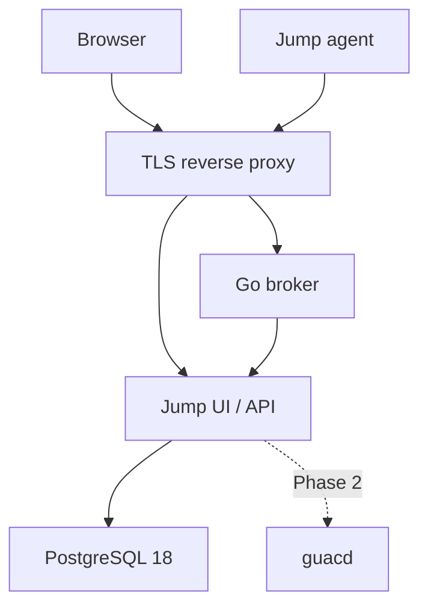

# Architecture

## Trust flow

The browser authenticates with a standards-based OIDC provider using authorization code flow and state/nonce validation through Authlib. Jump maps the pair `(issuer, subject)` to a local user. The first authenticated user becomes admin under a serialized database lock; later users get the user role. Privileged mutations check the admin role on the API. An HTTP-only, SameSite=Lax, Secure cookie holds a signed session identifier; mutating browser requests require an exact configured Origin and session-bound CSRF token. The identity provider owns MFA policy.

An admin creates a 256-bit random enrollment token. PostgreSQL stores only its SHA-256 digest, expiry, creator and redemption state. The browser displays plaintext once. The agent generates an Ed25519 keypair **before** enrollment, sends only its public key and token over HTTPS, and stores the private key locally. An atomic conditional database update consumes the token, creates a stable device UUID, and records the public key in one transaction.

For each new WebSocket connection, the broker fetches the active public key from the private API, sends a fresh 32-byte random challenge, and verifies a signature over `jump-agent-v1:` plus the challenge. It never reuses a nonce. A successful connection gets a unique connection ID. The API accepts heartbeat and disconnect only for the current ID, so an old connection cannot mark a replacement offline. Revoking an agent identity under the admin session records the actor and device, permanently rejects its public key, clears presence, and calls a separate authenticated private broker listener to close the active WebSocket. The connection registration and broker disconnect are serialized, while the API locks the device and identity rows so an in-flight handshake cannot revive a revoked device. Revocation retains the device record and audit history; deletion is a separate operation. A failed broker callback returns 503 after the revocation is committed, so an admin can retry the idempotent action; subsequent heartbeats and reconnects are still denied. The broker reconciles online flags on startup. It pings every 25 seconds and closes idle connections after 75 seconds; the agent heartbeats every 20 seconds and reconnects with capped exponential backoff and jitter.

The V1 JSON envelope has a mandatory `version` and `type`. Messages are capped at 16 KiB. Only `challenge`, `auth`, `ready`, and `heartbeat` exist. Future protocol versions can add typed stream open/data/close frames with stream IDs, flow control and per-operation authorization. Never treat the present connection as permission to perform endpoint actions.

## Data and credential boundary

Users, devices, group membership, many-to-many tags, enrollment tokens, Ed25519 public identities, credentials, and general audit events live in PostgreSQL. Devices use a UUID independent of hostname. Credential secrets are encrypted in the API with AES-256-GCM, a 96-bit random nonce, version number, and credential-ID authenticated associated data. `JUMP_MASTER_KEY` is external and never goes into PostgreSQL. The UI and device APIs have no endpoint for decrypted secrets. Phase 2 will add server-side credential selection and injection through the gateway. Future rotation will decrypt each record under its stored version and re-encrypt with the new key. Keep retired keys until rotation completes.

## Future session gateway

- RDP: browser → Jump session gateway → guacd → broker temporary reverse stream → persistent agent → `127.0.0.1:3389` on Windows.
- SSH: browser → Jump session gateway → guacd → broker temporary reverse stream → persistent agent → `127.0.0.1:22` on Linux.
- Files: browser → Jump API → broker → agent → local filesystem. Planned operations: list, upload, download, rename, delete, create directory. This is separate from Guacamole drive redirection and SFTP.

The agent initiates outbound TLS connections. Endpoints need no inbound Internet ports.

## Roadmap

- **Phase 2:** multiplexed reverse TCP streams, direct guacd integration, browser RDP and SSH, server-side credential selection/injection.
- **Phase 3:** cross-platform files, shell/PowerShell, reboot and restart-agent actions, richer system information.
- **Later:** physical-console screen sharing, attended Quick Support and consent workflows.

No VNC, session recording, multitenancy, monitoring, patching, alerting or billing is planned for this foundation.

## Known limitations

- No real remote sessions or file operations yet; capability names are descriptive.
- `current_user` reports the agent process account where available, not a detected interactive desktop session.
- No credential management API or UI yet. The encrypted model and service functions are in place.
- No internal device certificate authority yet. Ed25519 challenge/response can later be replaced by short-lived device certificates, keeping the same public identity and enrollment boundary.
- Presence is held by one broker process. Scaling to multiple replicas needs shared coordination and routing; run one broker for now.
- OIDC provider and its access policy must be configured by the operator. There is no local login or recovery login.
